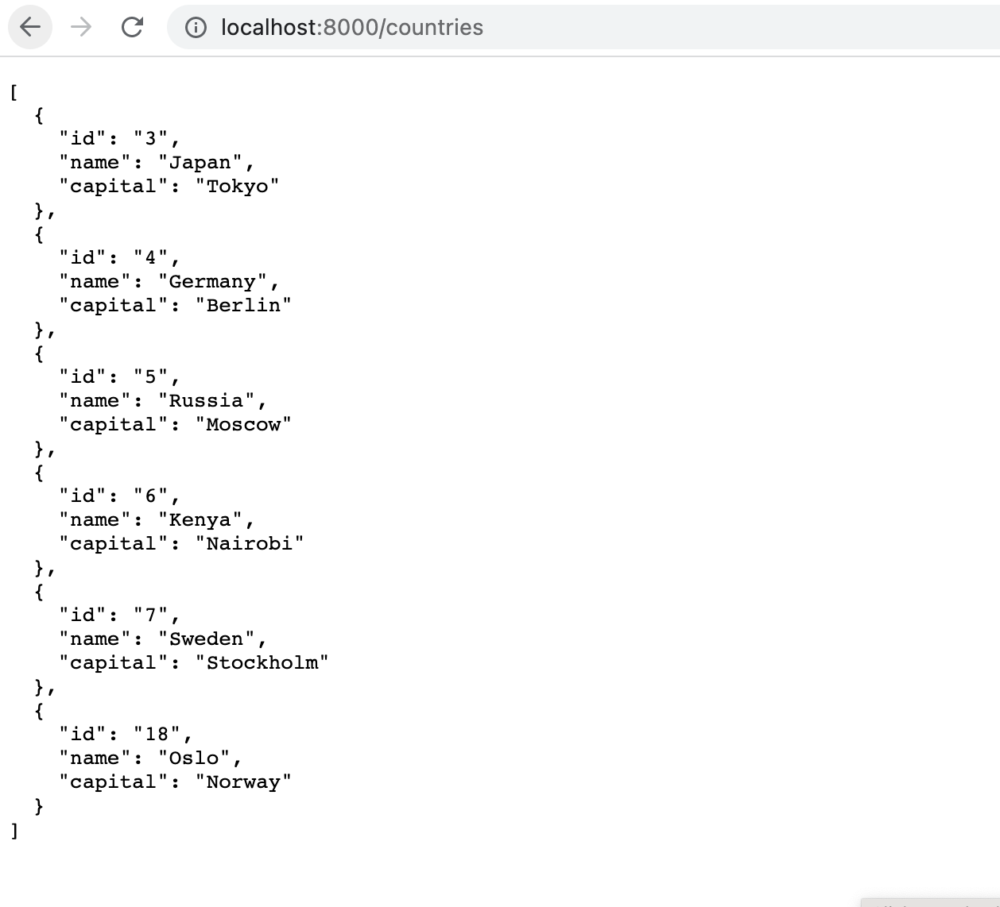
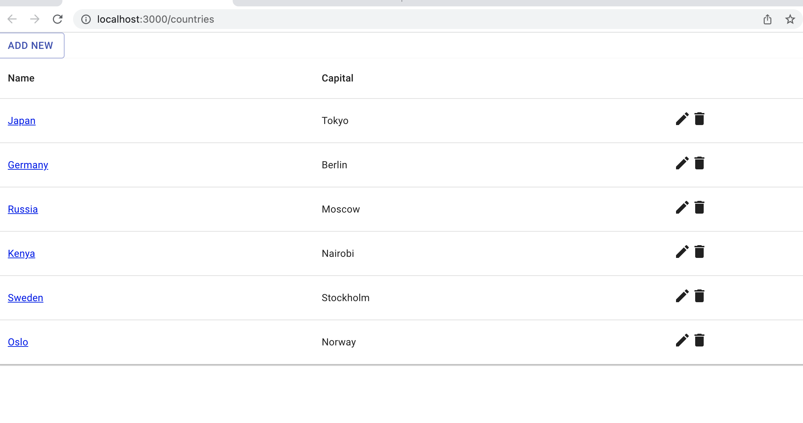

## Available Scripts

This was a practice app I forked, to learn about React and creating a temporary backend. It supports CRUD on the back end and the complimentary API operations on the front end. The sample database has information on countries. 

To run this, download this repository and navigate to it. Run the command below to instantiate the server and to run the react app. 

The JSON server can be started with `json-server --watch ./src/assets/mock-data/countries.json --port 8000` command too. Starts the JSON server at [http://localhost:8000](http://localhost:8000)

### `npm install`
### `npm start`

Runs the app in the development mode. 
Open [http://localhost:3000](http://localhost:3000) to view it in the browser.

